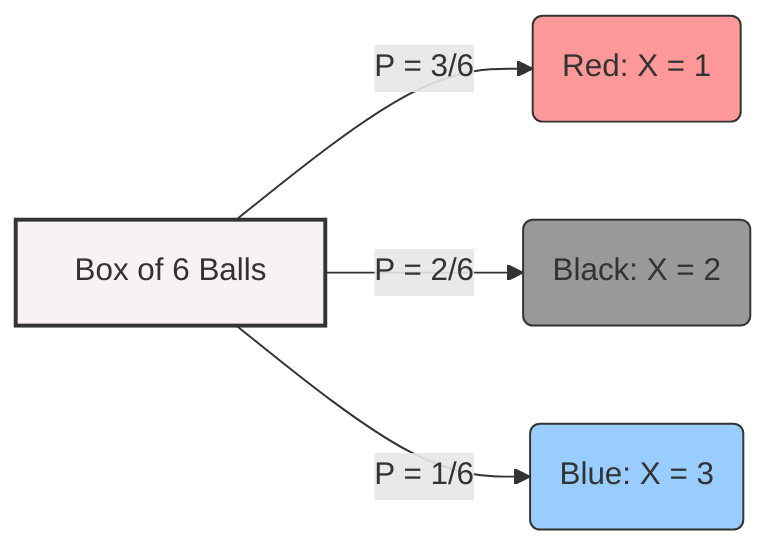
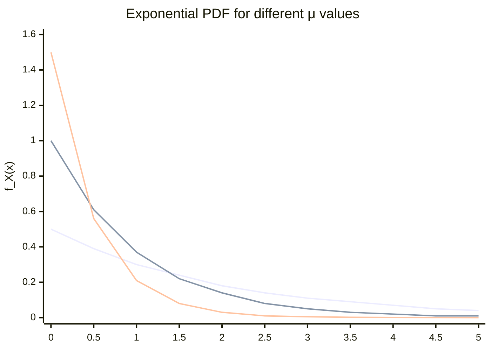
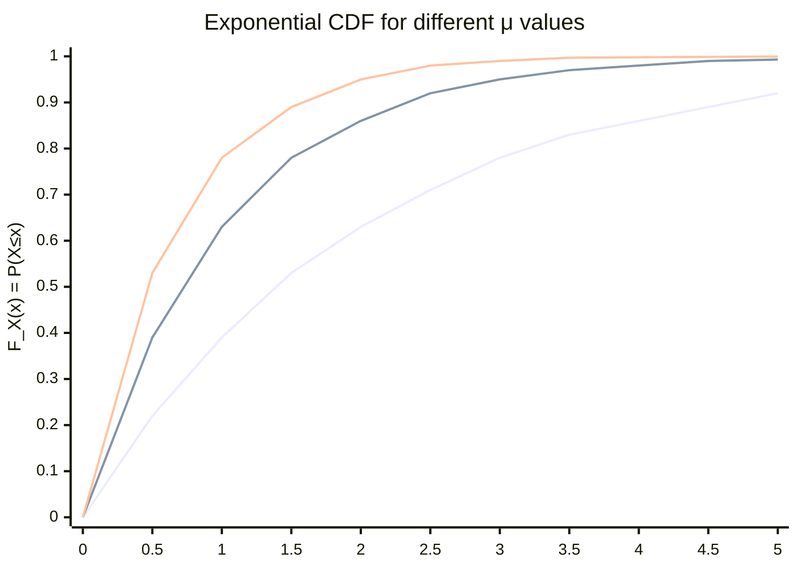

# Probability and Random Variables Review

## 1. Fundamentals of Probability

- **Probability:** The chance of an event occurring in an experiment.
    
- **Experiment Example:** Choosing a ball from a box.
    
    - If a box has 3 red, 1 blue, and 2 black balls, the probabilities are: $P(\text{Red}) = \frac{3}{6}$, $P(\text{blue}) = \frac{1}{6}$, $P(\text{black}) = \frac{2}{6}$.
        
- **Random Variable (R.V.):** A function that assigns numbers to events.
    
    - Using the previous example, we can assign $X=1$ for Red, $X=2$ for Black, and $X=3$ for Blue.



<div style="page-break-after: always;"></div>

## 2. Discrete Random Variables

A discrete R.V. takes on distinct, countable values.

- **Probability Mass Function (PMF):** Defines the probability of the variable equaling a specific value.
    
    $$P_X(x) = \text{Prob}(X=x)$$
    
- **Cumulative Distribution Function (CDF):** Defines the probability that the variable is less than or equal to a specific value.
    
    $$P_X(x) = \text{Prob}(X \le x)$$
    
- **Expectation (Average/Mean):**
    
    $$E(X) = \sum_{i} x_i \cdot P_X(x_i)$$
    
- **Variance:** The average of the squares minus the square of the average.
    
    $$\text{Var}(X) = \sigma_x^2 = E(X^2) - (E(X))^2$$
    
    - Where $E(X^2) = \sum_{i} x_i^2 \cdot P_X(x_i)$.
        
- **Standard Deviation:**
    
    $$\text{Std}(X) = \sigma_x = \sqrt{\text{Var}} = \sqrt{\sigma_x^2}$$
    

<div style="page-break-after: always;"></div>

## 3. Continuous Random Variables

A continuous R.V. takes on continuous values.

- **Probability Density Function (PDF):** $P_X(x)$.
    
- **Cumulative Distribution Function (CDF):**
    
    $$P_X(x) = \text{Prob}(X \le x) = \int_{-\infty}^{x} P_X(x) dx$$
    
    - **Useful CDF Properties:**
        
        - $P(X > x) = 1 - P(X \le x) = 1 - P_X(x)$
            
        - $P(a \le X \le b) = P_X(b) - P_X(a) = \int_{a}^{b} P_X(x) dx$
            
- **Expectation:**
    
    $$E(X) = \int_{-\infty}^{\infty} x \cdot P_X(x) dx$$
    
- **Variance:**
    
    $$\text{Var}(X) = \sigma_x^2 = E(X^2) - (E(X))^2 = \int_{-\infty}^{\infty} x^2 P_X(x) dx - \left(\int_{-\infty}^{\infty} x P_X(x) dx\right)^2$$
    

## 4. Important Probability Rules

- **Product Rule:** $P(A|B) = \frac{P(A,B)}{P(B)} \Rightarrow P(A,B) = P(A|B) \cdot P(B)$
    
- **Bayes' Rule:** $P(A|B) = \frac{P(B|A)P(A)}{P(B)}$
    
- **Conditional Expectation:** $E[X] = E[X|A]P(A) + E[X|B]P(B)$
    

<div style="page-break-after: always;"></div>

## 5. Exponential Random Variable

We are interested in the Exponential R.V. because it is commonly used to model inter-arrival times.

- **PDF:** $f_X(x) = \mu e^{-\mu x}$ if $x \ge 0$, and $0$ if $x \le 0$.
    
- **CDF:** 
    $$F_X(x) = P\{X \le x\} = \begin{cases} 1 - e^{-\mu x} & \text{if } x \ge 0 \\ 0 & \text{if } x < 0 \end{cases}$$
    
- **Mean & Variance:**
    
    - $E[X] = \frac{1}{\mu}$
        
    - $\text{Var}(X) = \frac{1}{\mu^2}$
        
- **Memoryless Property:** The distribution does not "remember" past time spent.
    
    $$P(X > x+t | X > t) = P(X > x)$$
    
    - _Proof outline:_ $\frac{P(X > x+t)}{P(X > t)} = \frac{e^{-\mu(x+t)}}{e^{-\mu t}} = e^{-\mu x}$.

### Exponential Distribution Graphs

**PDF: $f_X(x) = \mu e^{-\mu x}$**




**CDF: $F_X(x) = 1 - e^{-\mu x}$**




<div style="page-break-after: always;"></div>

## 6. Poisson Random Variable

A discrete R.V. that defines the probability of a random event occurring $k$ times over an interval. It is well known as a good model for arrivals in networks.

- **PMF:**
    
    $$P(X=k) = e^{-\lambda} \frac{\lambda^k}{k!}$$
    
    where $k = 0, 1, 2, 3 \dots$
    
- **Mean & Variance:**
    
    - $\lambda$ represents the average (or expected) number of events over the given interval.
        
    - $E[X] = \lambda$
        
    - $\text{Var}(X) = \lambda$
        
- **Relationship to Exponential R.V.:** For a Poisson R.V. $X$, the inter-arrival time between events is an Exponential R.V..
    
    - $P(T \le s) = 1 - P(X=0) = 1 - e^{-\lambda s}$, which matches the CDF of an Exponential R.V..
        


<div style="page-break-after: always;"></div>

## 7. Solved Examples

Example 1: Expectation and Variance

Suppose $X$ has the following PMF: $p(0)=0.2$, $p(1)=0.5$, $p(2)=0.3$.

**Answer:**

- $E[X] = 0(0.2) + 1(0.5) + 2(0.3) = 1.1$
    
- Let $Y = X^2$. $E[X^2] = E[Y] = 0(0.2) + 1(0.5) + 4(0.3) = 1.7$
    
- $\text{Var}[X] = E[X^2] - (E[X])^2 = 1.7 - (1.1)^2 = 0.49$
    

Example 2: Exponential Memoryless Property

Let $X$ be the amount of time a customer spends in a bank. $X$ is exponentially distributed with a mean of 10 minutes.

- **Q1:** What is the probability she spends more than 15 minutes?

    **Answer:** 
	X is exp (memoryless) -> $E[X]=10 \Rightarrow \mu = \frac{1}{10}$
    
    $P(X > 15) = e^{-15/10} = e^{-3/2}$

- **Q2:** Given that the customer is still in the bank after 10 minutes, what is the probability she will spend more than 15 minutes total?

    **Answer:** Because of the memoryless property, this is equivalent to finding the probability of spending at least 5 _more_ minutes: $P(X > 15-10) = P(X > 5) = e^{-5/10} = e^{-1/2}$.
        

<div style="page-break-after: always;"></div>


Example 3: Poisson Distribution

If the number of accidents occurring on a highway each day is a Poisson random variable with parameter $\lambda = 3$. What is the probability that no/1 accidents occur today?

**Given:**
- $\lambda = 3$ (average number of accidents per day)
- $E[X] = \lambda = 3$
- $\text{Var}(X) = \lambda = 3$

**PMF Formula:**
$$P(X=k) = e^{-\lambda} \frac{\lambda^k}{k!}$$

**Answer:**

**Q1: Probability of 0 accidents today:**

$$P(X=0) = e^{-\lambda} \frac{\lambda^0}{0!} = e^{-3} \frac{3^0}{1} = e^{-3} \cdot 1 = e^{-3}$$

$$P(X=0) = e^{-3} \approx 0.0498 \approx 4.98\%$$

**Q2: Probability of 1 accident today:**

$$P(X=1) = e^{-\lambda} \frac{\lambda^1}{1!} = e^{-3} \frac{3^1}{1} = e^{-3} \cdot 3 = 3e^{-3}$$

$$P(X=1) = 3e^{-3} \approx 0.1494 \approx 14.94\%$$
  
<div style="page-break-after: always;"></div>


Example 4: Poisson and Exponential

People enter a restaurant at a Poisson rate $\lambda = 1$ per day.

- **Q:** What is the probability that the elapsed time between the 10th and 11th arrival exceeds two days?

**Answer:**

The inter-arrival time between the 10th and 11th arrival ($\tau_{10}$) is an exponential random variable with rate $\mu = \lambda = 1$.

Using the relationship $P(X > x) = 1 - F_X(x) = 1 - (1 - e^{-\mu x}) = e^{-\mu x}$:

$$P\{\tau_{10} > 2\} = 1 - P\{\tau_{10} \le 2\} = 1 - F_{\tau}(2)$$

$$= 1 - (1 - e^{-\mu \cdot 2}) = 1 - (1 - e^{-1 \times 2})$$

$$= 1 - (1 - e^{-2}) = e^{-2}$$

$$
\boxed{P(T_{10} > 2) = e^{-2} \approx 0.1353 \approx 13.53\%}
$$

<div style="page-break-after: always;"></div>


Example 5: Discrete R.V. with PMF and CDF

You are monitoring the number of customers at a bank at 9, 10, 11 AM for four days:

| Days | 9 AM | 10 AM | 11 AM |
|------|------|-------|-------|
| 1 (Sun) | 10 | 8 | 16 |
| 2 (Mon) | 8 | 8 | 10 |
| 3 (Tue) | 10 | 16 | 8 |
| 4 (Wed) | 10 | 10 | 10 |

**Define the R.V.:** Let $X$ = number of customers at the bank. $X$ takes values $\{8, 10, 16\}$.

**PMF:**

**Answer:**

- $P(X=8) = \frac{4}{12}$ (occurs 4 times out of 12 observations)
- $P(X=10) = \frac{6}{12}$ (occurs 6 times out of 12 observations)
- $P(X=16) = \frac{2}{12}$ (occurs 2 times out of 12 observations)


**CDF:**

**Answer:**

$$F_X(x) = P(X \le x) = \begin{cases} 0 & x < 8 \\ \frac{4}{12} & 8 \le x < 10 \\ \frac{10}{12} & 10 \le x < 16 \\ 1 & x \ge 16 \end{cases}$$


**Expectation:**

**Answer:**

$$E[X] = \sum_{i} x_i \cdot P(x_i) = 8 \cdot \frac{4}{12} + 10 \cdot \frac{6}{12} + 16 \cdot \frac{2}{12} = \frac{32 + 60 + 32}{12} = \frac{124}{12} \approx 10.33$$

**Variance:**

**Answer:**

$$E[X^2] = 8^2 \cdot \frac{4}{12} + 10^2 \cdot \frac{6}{12} + 16^2 \cdot \frac{2}{12} = \frac{256 + 600 + 512}{12} = \frac{1368}{12} = 114$$

$$\text{Var}(X) = E[X^2] - (E[X])^2 = 114 - \left(\frac{124}{12}\right)^2 = 114 - \frac{15376}{144} = \frac{16416 - 15376}{144} = \frac{1040}{144} \approx 7.22$$
    


<div style="page-break-after: always;"></div>

## 8. Additional Example: Car Battery Life

**Problem:** Suppose that the number of miles that a car can run before its battery wears out is exponentially distributed with an average value of 10,000 miles. If a person desires to take a 5,000-mile trip, what is the probability that he or she will be able to complete the trip without having to replace the car battery?

**What can be said when the distribution is not exponential?**

**Answer:**

Let $X$ be the battery lifetime (in thousands of miles). $X$ is exponentially distributed with:

$$E[X] = 10 \text{ (thousand miles)}$$

Since $E[X] = \frac{1}{\mu}$ for an exponential distribution:

$$\mu = \frac{1}{10,000} \text{ per mile}$$

We want to find the probability that the battery lasts more than 5,000 miles:

$$P(X > 5) = 1 - P(X \le 5) = 1 - F_X(5)$$

Using the CDF:

$$P(X > 5) = 1 - (1 - e^{-\mu \cdot 5}) = e^{-\frac{1}{10} \cdot 5} = e^{-\frac{1}{2}}$$

$$P(X > 5) = e^{-0.5} \approx 0.6065 \approx 0.604$$

The probability of completing the 5,000-mile trip without replacing the battery is approximately **60.4%** (or exactly $e^{-1/2}$).


<div style="page-break-after: always;"></div>

**Discussion: What if the distribution is NOT exponential?**

If the battery lifetime does **not** follow an exponential distribution:

1. **We cannot use the memoryless property** — the probability of surviving an additional 5,000 miles depends on how much the battery has already been used.

2. **We would need to know the specific distribution** (e.g., Weibull, Normal, etc.) to calculate survival probabilities.

3. **The mean alone is insufficient** — we would need more parameters (variance, shape parameters) to fully characterize the distribution.

4. **Real-world batteries** typically have a "bathtub curve" failure rate: higher failure at the beginning (infant mortality) and end (wear-out) of life, with lower failure in between. This is better modeled by a Weibull distribution than an exponential distribution.


<div style="page-break-after: always;"></div>

## Appendix: Derivations for Exponential Random Variable

### Derivation of Mean $E[X]$

$$E[X] = \int_{-\infty}^{\infty} x \cdot f_X(x) \, dx = \int_{0}^{\infty} x \cdot \mu e^{-\mu x} \, dx$$

Using **integration by parts**: Let $u = x$ and $dv = \mu e^{-\mu x} \, dx$

Then $du = dx$ and $v = -e^{-\mu x}$

$$E[X] = \mu \int_{0}^{\infty} x e^{-\mu x} \, dx = \mu \left[ -\frac{x e^{-\mu x}}{\mu} \Big|_{0}^{\infty} + \int_{0}^{\infty} \frac{e^{-\mu x}}{\mu} \, dx \right]$$

$$= \mu \left[ -\frac{x e^{-\mu x}}{\mu} \Big|_{0}^{\infty} + \frac{1}{\mu} \int_{0}^{\infty} e^{-\mu x} \, dx \right]$$

Evaluating the first term:
- At $x = \infty$: $\lim_{x \to \infty} x e^{-\mu x} = 0$ (exponential decay beats linear growth)
- At $x = 0$: $0 \cdot e^{0} = 0$

So the first term equals $0 - 0 = 0$.

For the second term:
$$\int_{0}^{\infty} e^{-\mu x} \, dx = \left[ -\frac{e^{-\mu x}}{\mu} \right]_{0}^{\infty} = 0 - \left(-\frac{1}{\mu}\right) = \frac{1}{\mu}$$

Therefore:
$$E[X] = \mu \cdot \frac{1}{\mu} \cdot \frac{1}{\mu} = \frac{1}{\mu}$$

$$
\boxed{E[X] = \frac{1}{\mu}}
$$


<div style="page-break-after: always;"></div>


### Derivation of $E[X^2]$

$$E[X^2] = \int_{0}^{\infty} x^2 \cdot \mu e^{-\mu x} \, dx$$

Using integration by parts twice (first with $u = x^2$, $dv = \mu e^{-\mu x} dx$):

$$E[X^2] = \left[ -x^2 e^{-\mu x} \right]_{0}^{\infty} + 2\int_{0}^{\infty} x e^{-\mu x} \, dx$$

The first term evaluates to 0 (at both limits). For the second term, we already computed $\int_{0}^{\infty} x e^{-\mu x} \, dx = \frac{1}{\mu^2}$ in the mean derivation.

$$E[X^2] = 0 + 2 \cdot \frac{1}{\mu^2} = \frac{2}{\mu^2}$$

$$
\boxed{E[X^2] = \frac{2}{\mu^2}}
$$

### Derivation of Variance

$$\text{Var}(X) = E[X^2] - (E[X])^2 = \frac{2}{\mu^2} - \left(\frac{1}{\mu}\right)^2 = \frac{2}{\mu^2} - \frac{1}{\mu^2}$$

$$
\boxed{\text{Var}(X) = \frac{1}{\mu^2}}
$$

<div style="page-break-after: always;"></div>

### Derivation of the Memoryless Property

The **memoryless property** states:

$$P\{X > x+t \mid X > t\} = P\{X > x\}$$

**Part (A): Right-Hand Side (RHS)**

$$P\{X > x\} = 1 - P(X \le x) = 1 - (1 - e^{-\mu x}) = e^{-\mu x}$$

**Part (B): Left-Hand Side (LHS)**

Using the definition of conditional probability:

$$P\{X > x+t \mid X > t\} = \frac{P\{X > x+t, X > t\}}{P(X > t)}$$

Since if $X > x+t$ (and $x > 0$), then automatically $X > t$, so:

$$P\{X > x+t, X > t\} = P\{X > x+t\}$$

Therefore:

$$P\{X > x+t \mid X > t\} = \frac{P\{X > x+t\}}{P(X > t)}$$

Now compute each probability:

$$P\{X > x+t\} = 1 - P(X \le x+t) = 1 - (1 - e^{-\mu(x+t)}) = e^{-\mu(x+t)}$$

$$P\{X > t\} = 1 - P(X \le t) = 1 - (1 - e^{-\mu t}) = e^{-\mu t}$$

Substituting:

$$P\{X > x+t \mid X > t\} = \frac{e^{-\mu(x+t)}}{e^{-\mu t}} = \frac{e^{-\mu x} \cdot e^{-\mu t}}{e^{-\mu t}} = e^{-\mu x}$$

**Conclusion:**

$$\text{LHS} = e^{-\mu x} = \text{RHS}$$

Therefore, **$X$ is memoryless**.

$$
\boxed{P(X > x+t \mid X > t) = P(X > x) = e^{-\mu x}}
$$

<div style="page-break-after: always;"></div>

### Proof That Inter-Arrival Time is Exponential

This proof demonstrates the relationship between the **Poisson** and **Exponential** distributions.

**Setup:**
- Let $X$ be a Poisson random variable representing the number of arrivals/events in time $s$
- Let $\tau_n$ be the inter-arrival time between event $n$ and event $n+1$
- $\lambda$ = arrival rate (events per unit time)

**Timeline:**
```
Event                    No Events                    Event
   |<------------------- τ_n ------------------->|
t_n                                              t_{n+1}
```

**Finding the CDF of $\tau$:**

The probability that the inter-arrival time is less than or equal to $s$ is:

$$P\{\tau_n \le s\} = 1 - P(\text{no arrivals in time } s)$$

Since the number of arrivals follows a Poisson distribution:

$$P\{\tau_n \le s\} = 1 - P\{X = 0\}$$

Using the Poisson PMF with $k = 0$:

$$P\{X = 0\} = e^{-\lambda s} \frac{(\lambda s)^0}{0!} = e^{-\lambda s} \cdot \frac{1}{1} = e^{-\lambda s}$$

Therefore:

$$P\{\tau_n \le s\} = 1 - e^{-\lambda s}$$

**Conclusion:**

The CDF $F_{\tau}(s) = 1 - e^{-\lambda s}$ is exactly the CDF of an **Exponential random variable** with parameter $\mu = \lambda$.

$$
\boxed{\text{The inter-arrival time } \tau \text{ follows an Exponential distribution with rate } \lambda}
$$

