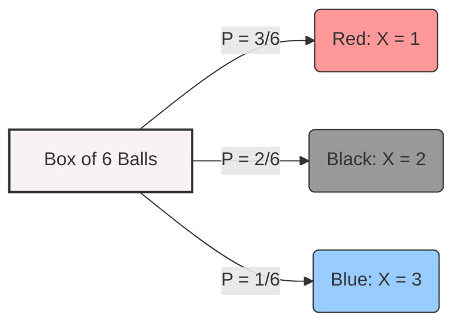

# Probability and Random Variables Review

## 1. Fundamentals of Probability

- **Probability:** The chance of an event occurring in an experiment.
    
- **Experiment Example:** Choosing a ball from a box.
    
    - If a box has 3 red, 1 blue, and 2 black balls, the probabilities are: $P(\text{Red}) = \frac{3}{6}$, $P(\text{blue}) = \frac{1}{6}$, $P(\text{black}) = \frac{2}{6}$.
        
- **Random Variable (R.V.):** A function that assigns numbers to events.
    
    - Using the previous example, we can assign $X=1$ for Red, $X=2$ for Black, and $X=3$ for Blue.

## 2. Discrete Random Variables

A discrete R.V. takes on distinct, countable values.

- **Probability Mass Function (PMF):** Defines the probability of the variable equaling a specific value.
    
    $$P_X(x) = \text{Prob}(X=x)$$
    
- **Cumulative Distribution Function (CDF):** Defines the probability that the variable is less than or equal to a specific value.
    
    $$P_X(x) = \text{Prob}(X \le x)$$
    
- **Expectation (Average/Mean):**
    
    $$E(X) = \sum_{i} x_i \cdot P_X(x_i)$$
    
- **Variance:** The average of the squares minus the square of the average.
    
    $$\text{Var}(X) = \sigma_x^2 = E(X^2) - (E(X))^2$$
    
    - Where $E(X^2) = \sum_{i} x_i^2 \cdot P_X(x_i)$.
        
- **Standard Deviation:**
    
    $$\text{Std}(X) = \sigma_x = \sqrt{\text{Var}} = \sqrt{\sigma_x^2}$$
    

## 3. Continuous Random Variables

A continuous R.V. takes on continuous values.

- **Probability Density Function (PDF):** $P_X(x)$.
    
- **Cumulative Distribution Function (CDF):**
    
    $$P_X(x) = \text{Prob}(X \le x) = \int_{-\infty}^{x} P_X(x) dx$$
    
    - **Useful CDF Properties:**
        
        - $P(X > x) = 1 - P(X \le x) = 1 - P_X(x)$
            
        - $P(a \le X \le b) = P_X(b) - P_X(a) = \int_{a}^{b} P_X(x) dx$
            
- **Expectation:**
    
    $$E(X) = \int_{-\infty}^{\infty} x \cdot P_X(x) dx$$
    
- **Variance:**
    
    $$\text{Var}(X) = \sigma_x^2 = E(X^2) - (E(X))^2 = \int_{-\infty}^{\infty} x^2 P_X(x) dx - \left(\int_{-\infty}^{\infty} x P_X(x) dx\right)^2$$
    

## 4. Important Probability Rules

- **Product Rule:** $P(A|B) = \frac{P(A,B)}{P(B)} \Rightarrow P(A,B) = P(A|B) \cdot P(B)$
    
- **Bayes' Rule:** $P(A|B) = \frac{P(B|A)P(A)}{P(B)}$
    
- **Conditional Expectation:** $E[X] = E[X|A]P(A) + E[X|B]P(B)$
    

## 5. Exponential Random Variable

We are interested in the Exponential R.V. because it is commonly used to model inter-arrival times.

- **PDF:** $f_X(x) = \mu e^{-\mu x}$ if $x \ge 0$, and $0$ if $x \le 0$.
    
- **CDF:** $F_X(x) = P(X \le x) = 1 - e^{-\mu x}$ if $x \ge 0$.
    
- **Mean & Variance:**
    
    - $E[X] = \frac{1}{\mu}$
        
    - $\text{Var}(X) = \frac{1}{\mu^2}$
        
- **Memoryless Property:** The distribution does not "remember" past time spent.
    
    $$P(X > x+t | X > t) = P(X > x)$$
    
    - _Proof outline:_ $\frac{P(X > x+t)}{P(X > t)} = \frac{e^{-\mu(x+t)}}{e^{-\mu t}} = e^{-\mu x}$.
        

## 6. Poisson Random Variable

A discrete R.V. that defines the probability of a random event occurring $k$ times over an interval. It is well known as a good model for arrivals in networks.

- **PMF:**
    
    $$P(X=k) = e^{-\lambda} \frac{\lambda^k}{k!}$$
    
    where $k = 0, 1, 2, 3 \dots$
    
- **Mean & Variance:**
    
    - $\lambda$ represents the average (or expected) number of events over the given interval.
        
    - $E[X] = \lambda$
        
    - $\text{Var}(X) = \lambda$
        
- **Relationship to Exponential R.V.:** For a Poisson R.V. $X$, the inter-arrival time between events is an Exponential R.V..
    
    - $P(T \le s) = 1 - P(X=0) = 1 - e^{-\lambda s}$, which matches the CDF of an Exponential R.V..
        

---

## 7. Solved Examples

Example 1: Expectation and Variance

Suppose $X$ has the following PMF: $p(0)=0.2$, $p(1)=0.5$, $p(2)=0.3$.

- $E[X] = 0(0.2) + 1(0.5) + 2(0.3) = 1.1$
    
- Let $Y = X^2$. $E[X^2] = E[Y] = 0(0.2) + 1(0.5) + 4(0.3) = 1.7$
    
- $\text{Var}[X] = E[X^2] - (E[X])^2 = 1.7 - (1.1)^2 = 0.49$
    

Example 2: Exponential Memoryless Property

Let $X$ be the amount of time a customer spends in a bank. $X$ is exponentially distributed with a mean of 10 minutes ($E[X]=10 \Rightarrow \mu = \frac{1}{10}$).

- **Q1:** What is the probability she spends more than 15 minutes?
    
    - $P(X > 15) = e^{-15/10} = e^{-3/2}$
        
- **Q2:** Given that the customer is still in the bank after 10 minutes, what is the probability she will spend more than 15 minutes total?
    
    - Because of the memoryless property, this is equivalent to finding the probability of spending at least 5 _more_ minutes: $P(X > 5) = e^{-5/10} = e^{-1/2}$.
        

Example 3: Poisson Distribution

If the number of accidents on a highway each day is a Poisson R.V. with parameter $\lambda = 3$.

- Probability of 0 accidents today: $P(X=0) = e^{-3}$
    
- Probability of 1 accident today: $P(X=1) = 3e^{-3}$
    

Example 4: Poisson and Exponential

People enter a restaurant at a Poisson rate $\lambda = 1$ per day.

- **Q:** What is the probability that the elapsed time between the 10th and 11th arrival exceeds two days?
    
- **Solution:** The inter-arrival time is exponential, so $P(T_{10} > 2) = e^{-1 \times 2} = e^{-2}$.
    

